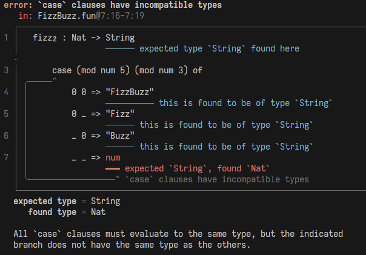

# report

[](https://hex.pm/packages/report)
[](https://hexdocs.pm/report/)

Create informative & beautiful source code reports.




## Usage

Install with the `gleam` CLI. This package works on all targets!

```sh
gleam add report
```

The following code will display the demo report found in the image above.

```gleam
import gleam/io
import report

const source = "type Foo {
  Bar
  Baz
}

pub fn main() {
  let foo = Baz

  case foo {
    Bar -> 3.14
    Baz -> 50
  }
}"

pub fn main() {
  // Create an error report. This could also be `report.warning` or `report.info`.
  report.error(
    file: "test_module.gleam",
    source:,
    message: "Type mismatch",
    from: #(11, 12),
    to: #(11, 14),
    label: "I wanted a `Float` but got an `Int`",
  )
  // Context points to a location in the source with the given message, providing
  // a way to point out helpful landmarks in the surrounding code.
  |> report.with_context(#(9, 3), "in this case expression")
  // Add additional information to the report with notes.
  |> report.with_notes([
    report.Text("All case branches must evaluate to the same type, but this branch did not evaluate to the type I wanted: Float"),
    report.Hint("Since this value is an integer literal, the suffix `.0` can be appended to the number to turn it into a Float. This will solve the problem!")
  ])
  // Finally, turn the report into a string with styling enabled.
  |> report.to_string(style: True)
  |> io.println_error
}
```

Documentation can be found at <https://hexdocs.pm/report>.

## Versioning

This package follows semver, but stylistic changes such as tweaking colors are not covered by a major version. There will be no breaking changes to the actual API without a major bump.

## Development

```sh
gleam run   # Run the project
gleam test  # Run the tests
```

## Inspiration

This package is inspired by similar projects such as [Hug](https://hexdocs.pm/hug/), [Diagnose](https://github.com/Mesabloo/diagnose), and [Codespan Reporting](https://github.com/brendanzab/codespan). `report` is most similar to Hug API-wise.